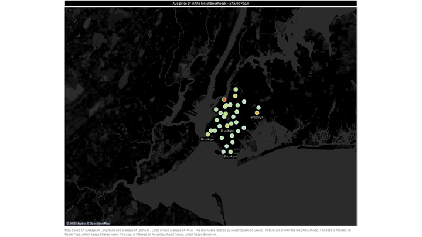
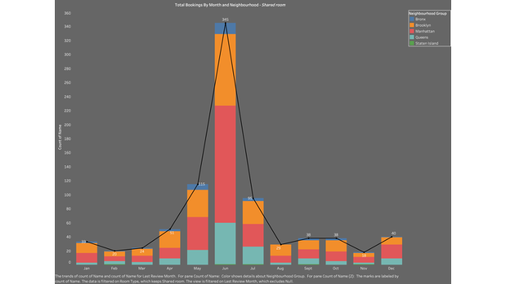
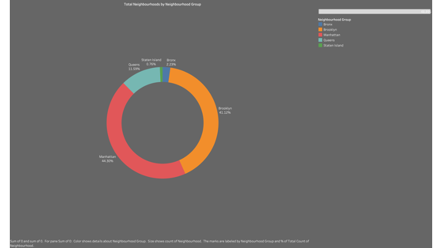
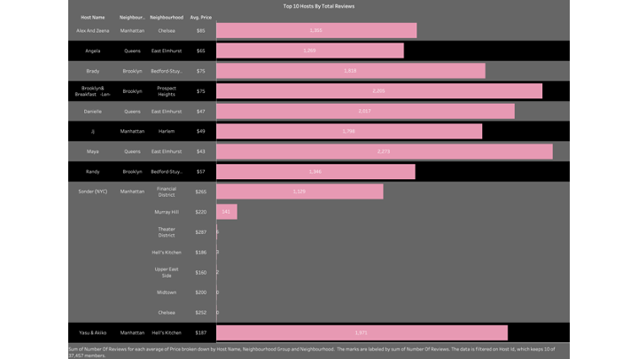
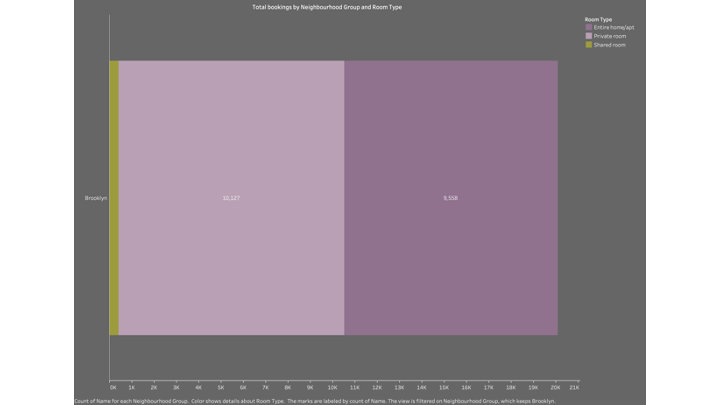
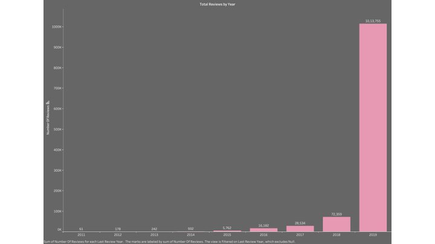
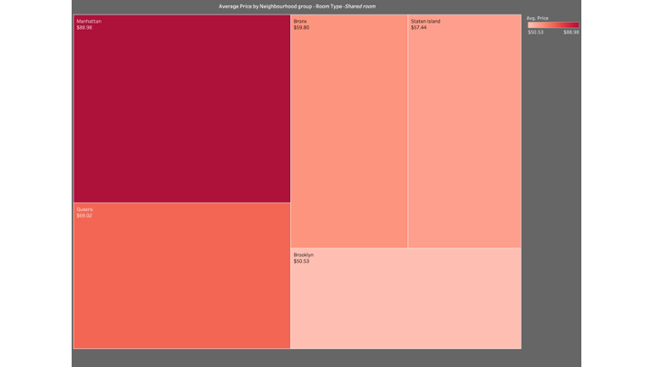
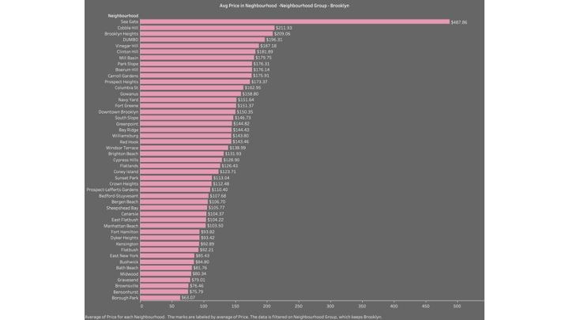
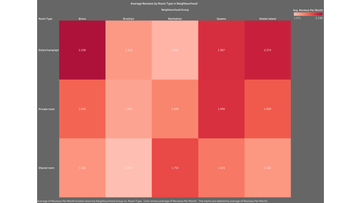
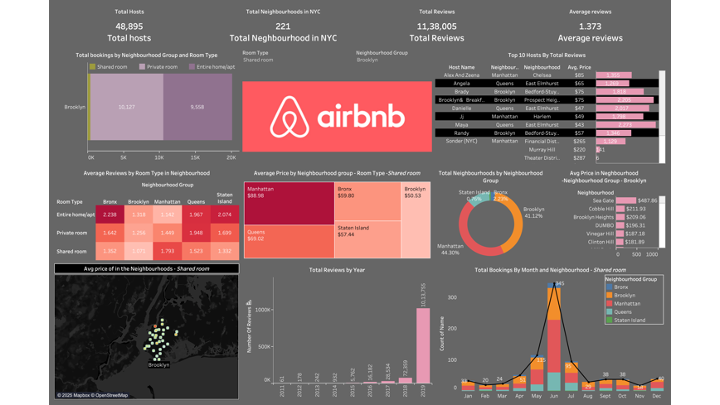

### **Project Overview: Airbnb Dashboard**

#### **Objective**
The dashboard provides insights into Airbnb data in New York City, focusing on:
- Hosts, neighborhoods, and reviews.
- Pricing trends across room types and locations.
- Booking patterns by time and geography.
- Top-performing hosts based on reviews and profitability.

#### **Key Features**
1. **Summary Metrics**:
   - Total Hosts, Neighborhoods, and Reviews.
   - Average Reviews per Listing.

2. **Bookings by Room Type and Neighborhood**:
   - Distribution of room types and bookings across various neighborhoods.

3. **Top 10 Hosts by Reviews**:
   - Detailed table showing host names, locations, room types, and performance metrics.

4. **Pricing Trends**:
   - Analysis of average prices across room types and neighborhood groups.

5. **Geographic Insights**:
   - Heatmaps highlighting price trends and distribution across neighborhoods.

6. **Trends Over Time**:
   - Growth in reviews and monthly booking trends across room types.

#### **Use Cases**
- **Hosts**: Optimize pricing and improve performance.
- **Travelers**: Discover budget-friendly options and compare locations.
- **Analysts**: Study trends, identify top-performing areas, and analyze preferences.
- **Policy Makers**: Understand the impact of Airbnb on neighborhoods for urban planning.

### **Heatmap Visualization: Airbnb Shared Room Prices in Brooklyn**

#### **1. Heatmap Display**
- The map highlights different neighborhoods in Brooklyn using **colored circles**.
- **Color Intensity**:
  - Darker or more intense colors indicate **higher average prices** for shared rooms.

#### **2. Tooltip Information**
- Hovering over a circle reveals detailed information about the neighborhood, such as:
  - **Neighborhood Group**: Example - Brooklyn.
  - **Latitude**: Example - 40.6826.
  - **Longitude**: Example - -73.8747.
  - **Average Price**: Example - $34.7 (indicative of shared room pricing).

#### **3. Focus**
- The heatmap focuses on **shared accommodations**, offering insights into affordable housing options in Brooklyn neighborhoods.

### **Insights and Use Cases**
- **For Travelers**: Identifies budget-friendly neighborhoods for staying in Brooklyn.
- **For Hosts**: Helps understand pricing trends to set competitive rates.
- **For Analysts**: Offers geographic insights into how shared room prices vary across neighborhoods.

### **Chart Explanation: Total Bookings By Month and Neighborhood (Shared Rooms)**

#### **1. Title**
- **Total Bookings By Month and Neighbourhood - Shared Room**

#### **2. X-Axis**
- Represents **Months** (January to December).

#### **3. Y-Axis**
- Represents the **Count of Names**, ranging from 0 to 360.

#### **4. Categories**
- The chart is segmented by **Neighborhood Groups**:
  - **Bronx**: Represented in blue.
  - **Brooklyn**: Represented in orange.
  - **Manhattan**: Represented in red.
  - **Queens**: Represented in green.
  - **Staten Island**: Represented in gray.

#### **5. Key Data Points**
- **January**: Total bookings = 33.
- **February**: Total bookings = 20.
- **March**: Total bookings = 24.
- **April**: Total bookings = 91.
- **May**: Total bookings = 115.
- **June**: Total bookings = 345 (peak bookings).
- **July**: Total bookings = 95.
- **August**: Total bookings = 29.
- **September**: Total bookings = 38.
- **October**: Total bookings = 38.
- **November**: Total bookings = 18.
- **December**: Total bookings = 40.

#### **6. Notable Highlights**
- **Highest Month**: June, with **345 total bookings**.
- **Lowest Month**: November, with **18 total bookings**.
- **Consistent Contributors**: Manhattan and Brooklyn have the **highest contributions** across all months.

#### **7. Additional Information**
- The chart includes a **line graph overlay**, illustrating the trend of the **Count of Names**, which mirrors the fluctuations in total bookings.

### **Chart Explanation: Total Neighbourhoods by Neighbourhood Group**

#### **1. Title**
- The chart is titled **"Total Neighbourhoods by Neighbourhood Group"**.

#### **2. Type**
- **Donut Chart**: This visualization is a donut chart.

#### **3. Segments**
- The chart is divided into **five segments**, each representing a **Neighbourhood Group** in New York City.

#### **4. Neighborhood Group Distribution**
- **Manhattan**:
  - Percentage: **44.30%**
  - Represented by the **red segment**.
- **Brooklyn**:
  - Percentage: **41.12%**
  - Represented by the **orange segment**.
- **Queens**:
  - Percentage: **11.59%**
  - Represented by the **light blue segment**.
- **Bronx**:
  - Percentage: **2.23%**
  - Represented by the **dark blue segment**.
- **Staten Island**:
  - Percentage: **0.76%**
  - Represented by the **green segment**.

#### **5. Legend**
- A color-coded legend is included on the right side of the chart for quick reference to the Neighbourhood Groups.

#### **6. Insights**
- The chart shows that **Manhattan** and **Brooklyn** collectively account for the majority of neighborhoods.
- **Queens** has a moderate share, while **Bronx** and **Staten Island** contribute a smaller percentage to the total.

### **Chart Explanation: Top 10 Hosts By Total Reviews**

#### **1. Chart Overview**
- This bar chart displays the **top 10 Airbnb hosts in New York City** based on the total number of reviews for their listings.

#### **2. Key Elements**
- **Host Details**:
  - Each bar corresponds to a host and provides detailed information about them, including:
    - **Host Name**
    - **Neighbourhood Group** (e.g., Manhattan, Queens, Brooklyn)
    - **Neighbourhood** (e.g., Chelsea, East Elmhurst)
    - **Average Price** per night
    - **Total Reviews**

- **Bars**:
  - The **pink bars** visually represent the **total number of reviews** for each host.
  - The **length of the bar** is proportional to the number of reviews.

#### **3. Top 10 Hosts**
1. **Alex And Zeena**:
   - **Neighbourhood Group**: Manhattan
   - **Neighbourhood**: Chelsea
   - **Average Price**: $85
   - **Total Reviews**: 1,355

2. **Angela**:
   - **Neighbourhood Group**: Queens
   - **Neighbourhood**: East Elmhurst
   - **Average Price**: $65
   - **Total Reviews**: 1,269

3. **Brady**:
   - **Neighbourhood Group**: Brooklyn
   - **Neighbourhood**: Bedford-Stuyvesant
   - **Average Price**: $75
   - **Total Reviews**: 1,818

4. **Brooklyn8 Breakfast-Len**:
   - **Neighbourhood Group**: Brooklyn
   - **Neighbourhood**: Prospect Heights
   - **Average Price**: $75
   - **Total Reviews**: 2,205

5. **Danielle**:
   - **Neighbourhood Group**: Queens
   - **Neighbourhood**: East Elmhurst
   - **Average Price**: $47
   - **Total Reviews**: 2,017

6. **Jj**:
   - **Neighbourhood Group**: Manhattan
   - **Neighbourhood**: Harlem
   - **Average Price**: $49
   - **Total Reviews**: 1,798

7. **Maya**:
   - **Neighbourhood Group**: Queens
   - **Neighbourhood**: East Elmhurst
   - **Average Price**: $43
   - **Total Reviews**: 2,273

8. **Randy**:
   - **Neighbourhood Group**: Brooklyn
   - **Neighbourhood**: Bedford-Stuyvesant
   - **Average Price**: $57
   - **Total Reviews**: 1,346

9. **Sonder (NYC)**:
   - **Neighbourhood Group**: Manhattan
   - **Neighbourhood**: Financial District
   - **Average Price**: $265
   - **Total Reviews**: 1,129

10. **Yasu & Akiko**:
    - **Neighbourhood Group**: Manhattan
    - **Neighbourhood**: Hell's Kitchen
    - **Average Price**: $187
    - **Total Reviews**: 1,971

#### **4. Key Insights**
- **Maya** is the host with the **highest number of reviews** (2,273) and offers listings in Queens at a very affordable average price ($43).
- **Sonder (NYC)** has the **highest average price per night** ($265) while maintaining a substantial total of 1,129 reviews.
- The chart provides a mix of hosts from various Neighbourhood Groups, showcasing trends in host performance and pricing across NYC.

### **Chart Explanation: Total Bookings by Neighbourhood Group and Room Type**

#### **1. Title**
- **Total bookings by Neighbourhood Group and Room Type**

#### **2. Chart Type**
- **Horizontal Bar Chart**

#### **3. Categories**
- The chart categorizes bookings in Brooklyn by **Room Types**, which are:
  - **Entire home/apt**: Light purple bars.
  - **Private room**: Purple bars.
  - **Shared room**: Olive green bars.

#### **4. Data Points**
- Total bookings for each room type in Brooklyn:
  - **Shared room**: 413 bookings.
  - **Private room**: 10,127 bookings.
  - **Entire home/apt**: 9,558 bookings.

#### **5. Analysis**
- **Private rooms** have the highest number of bookings (10,127), showing their popularity in Brooklyn.
- **Entire homes/apartments** are also highly sought after, with 9,558 bookings.
- **Shared rooms** account for the lowest number of bookings (413), indicating less demand.

#### **6. Relevance**
- This chart highlights the **preference trends of room types** in Brooklyn, useful for:
  - Property owners to set competitive offerings.
  - Analysts to understand accommodation trends in this area.
  - Renters to gauge availability and preferences.

### **Chart Explanation: Total Reviews by Year**

#### **Overview**
- This chart shows the **number of reviews** received each year from **2011 to 2019**.
- The x-axis represents the **years (2011–2019)**, and the y-axis represents the **number of reviews** in increments of **50,000**.

#### **Key Data Points**
1. **2011**: 61 reviews
2. **2012**: 178 reviews
3. **2013**: 242 reviews
4. **2014**: 932 reviews
5. **2015**: 5,762 reviews
6. **2016**: 16,182 reviews
7. **2017**: 28,534 reviews
8. **2018**: 72,359 reviews
9. **2019**: 1,013,755 reviews (peak)

#### **Trend**
- The chart demonstrates a **steady increase** in the number of reviews over the years, starting with modest growth from 2011 to 2014.
- From 2015 onward, the number of reviews shows **exponential growth**, with 2019 witnessing a dramatic spike, crossing **1 million reviews**.

#### **Insights**
- The growth trend likely indicates:
  - A significant increase in user engagement.
  - A growing user base on the platform.
- 2019 stands out as a breakthrough year with a substantial rise in reviews, suggesting either a surge in popularity or a broader reach.

### **Chart Explanation: Average Price of Shared Rooms by Neighbourhood Group**

#### **1. Chart Type**
- **Treemap Chart**: This chart visualizes the average price of shared rooms for different neighborhood groups in New York City.

#### **2. Title**
- **Average Price by Neighbourhood Group • Room Type: Shared Room**

#### **3. Neighborhood Groups and Prices**
- The chart is divided into sections, each representing a neighborhood group, along with its average price:
  - **Manhattan**: $88.98
  - **Queens**: $69.02
  - **Bronx**: $59.80
  - **Staten Island**: $57.44
  - **Brooklyn**: $50.53

#### **4. Color Coding**
- The chart uses a **color gradient** to visually represent average price ranges:
  - **Darker colors** indicate higher prices.
  - **Lighter colors** indicate lower prices.
- Example: Manhattan, having the highest price, is shown in the darkest color, while Brooklyn, with the lowest price, is displayed in the lightest shade.

#### **5. Room Type**
- The chart specifically focuses on the "Shared Room" type, as indicated in the filter options on the right side.

#### **6. Insights**
- **Manhattan** is the most expensive neighborhood group for shared rooms, with an average price of $88.98.
- **Brooklyn** offers the most affordable shared rooms, averaging $50.53.
- This visualization allows users to quickly compare price trends for shared rooms across different neighborhood groups.

### **Chart Explanation: Avg Price in Neighbourhood - Neighbourhood Group: Brooklyn**

#### **1. Chart Overview**
- **Type**: Horizontal bar chart.
- **Title**: Avg Price in Neighbourhood - Neighbourhood Group: Brooklyn.
- **Purpose**: To display the average price of properties in different neighborhoods within the Brooklyn neighborhood group.

#### **2. Key Elements**
- **X-Axis**:
  - Represents the **average price in dollars** for properties in each neighborhood.
  - Prices are arranged in descending order (highest to lowest).

- **Y-Axis**:
  - Lists the **neighborhood names** within Brooklyn.

- **Bars**:
  - Each bar corresponds to a neighborhood and its average price.
  - **Color**: All bars are shaded in pink for uniformity.
  
- **Legend**:
  - Located on the right side, showing available neighborhood group filters, with **Brooklyn** selected.

#### **3. Notable Data Points**
- **Neighborhoods with the Highest Average Prices**:
  1. **Sea Gate**: $487.86
  2. **Cobble Hill**: $211.93
  3. **Brooklyn Heights**: $209.06
  4. **DUMBO**: $196.31
  5. **Vinegar Hill**: $187.18

- **Neighborhood with the Lowest Average Price**:
  - **Borough Park**: $63.07.

#### **4. Insights**
- The chart highlights significant variation in average prices across neighborhoods within Brooklyn.
- **Sea Gate** stands out with the highest average price, likely indicating it is an upscale area.
- **Borough Park** has the lowest average price, suggesting it may be more affordable.

#### **5. Applications**
- Useful for:
  - **Homebuyers or Renters**: To identify neighborhoods in Brooklyn matching their budget.
  - **Real Estate Analysts**: To study pricing trends.
  - **Investors**: To compare property values across neighborhoods.

### **Chart Explanation: Average Reviews by Room Type in Neighbourhood Group**

#### **1. Chart Type**
- **Heatmap Chart**

#### **2. Title**
- **Average Reviews by Room Type in Neighbourhood Group**

#### **3. Axis Details**
- **X-Axis**: Represents the **Neighbourhood Group** (Bronx, Brooklyn, Manhattan, Queens, Staten Island).
- **Y-Axis**: Represents the **Room Type** (Entire home/apt, Private room, Shared room).

#### **4. Data Representation**
- The chart uses **color intensity** to represent the **average number of reviews per month**.
  - **Darker colors**: Indicate higher average reviews.
  - **Lighter colors**: Indicate lower average reviews.

#### **5. Key Data Points**
- **Entire home/apt**:
  - Bronx: 2.238
  - Brooklyn: 1.318
  - Manhattan: 1.142
  - Queens: 1.967
  - Staten Island: 2.074
- **Private room**:
  - Bronx: 1.642
  - Brooklyn: 1.256
  - Manhattan: 1.449
  - Queens: 1.948
  - Staten Island: 1.699
- **Shared room**:
  - Bronx: 1.352
  - Brooklyn: 1.071
  - Manhattan: 1.793
  - Queens: 1.523
  - Staten Island: 1.332

#### **6. Insights**
- The Bronx and Staten Island show the **highest average reviews for Entire home/apt**.
- Brooklyn records the **lowest average reviews for Shared rooms**.
- Manhattan’s Shared rooms have relatively high average reviews compared to other neighborhoods.

#### **7. Applications**
- **Hosts**: Understand review activity trends across neighborhoods and room types.
- **Travelers**: Gauge the popularity of specific room types in various areas.
- **Analysts**: Study the correlation between room types, neighborhoods, and review activity.

### **Key Performance Indicators (KPIs) Overview**

#### **1. Total Hosts**
- **Value**: 48,895
- **Significance**: This represents the total number of unique hosts on the Airbnb platform in New York City, showcasing the scale of hosting activity in the area.

#### **2. Total Neighbourhoods in NYC**
- **Value**: 221
- **Significance**: Indicates the number of neighborhoods across New York City with active Airbnb listings, emphasizing the geographic diversity of accommodation options.

#### **3. Total Reviews**
- **Value**: 1,138,005
- **Significance**: Reflects the cumulative number of reviews received for all Airbnb listings, highlighting the engagement level and user activity on the platform.

#### **4. Average Reviews**
- **Value**: 1.373
- **Significance**: This metric shows the average number of reviews per listing, giving insight into user interaction and feedback frequency for individual accommodations.

### **Final Dashboard Overview**

#### **Objective**
The final dashboard provides insights into Airbnb data in New York City. It visualizes key metrics, trends, and highlights critical information for hosts, travelers, and analysts.

